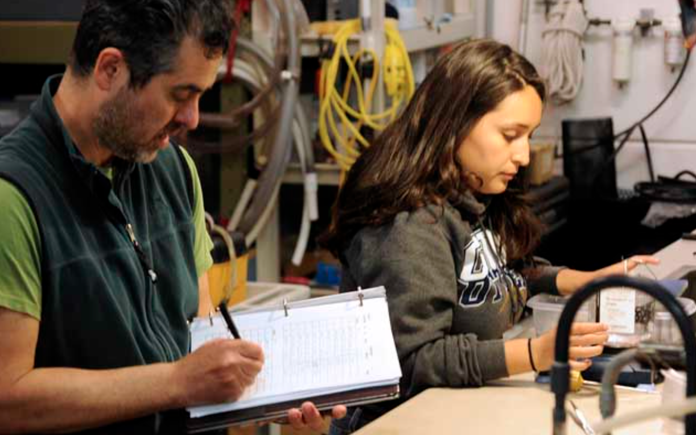

```{r setup, include=FALSE}
knitr::opts_chunk$set(echo = FALSE)
```

I am originally from Lima, Peru, but largely grew up in Los Angeles. I am a first generation college student who graduated cum laude at California State University, Monterey Bay with a B.S. in Environmental Science, Technology, & Policy. I am a self-motivated, fast learner and eager to apply my skills in a meaningful way to the environmental management field.

## Experience

During my undergraduate education I was a part of the National Science Foundation's Research Experience for Undergraduates program. I had the opportunity to work with Dr. Steve Litvin & Dr. Jim Barry at the Monterey Bay Aquarium Research Institute documenting the effects of current and future climate change on abalone. I presented the results of my research at conferences such as SACNAS and the California Central Coast Chapter of The Wildlife Society's Annual Symposium in 2018. I also volunteered with the non-profit organization Return of the Natives, where I co-taught an environmental education program for local elementary school children and assisted with community planting events aiming to restore native dune flora to the Monterey coast. Now, I am working as a research assistant for Dr. Anastasia Quintana, aiding her postdoctoral research on compliance in small-scale fisheries.



## Interests

I love being outdoors and exploring local trails, with a particular affinity for surveying herptile communities (lizards, snakes, amphibians). My favorite undergraduate field days were the ones where I could interact with native California wildlife and learn about their ecology and relevant conservation efforts. You can always find me in the field looking for cool snakes and lizards! I previously volunteered at the UCSC Fort Ord National Reserve monitoring coastal horned lizard populations to inform the dissertation of Ph.D. candidate Danielle Davis.


Aside from that, I am highly passionate about environmental justice issues and I am an avid supporter of black & indigenous rights. I hope to apply my data analysis skills to serve underprivileged groups facing environmental justice issues.

I currently reside in Goleta, CA (Chumash land) with my pet bunny and partner.


