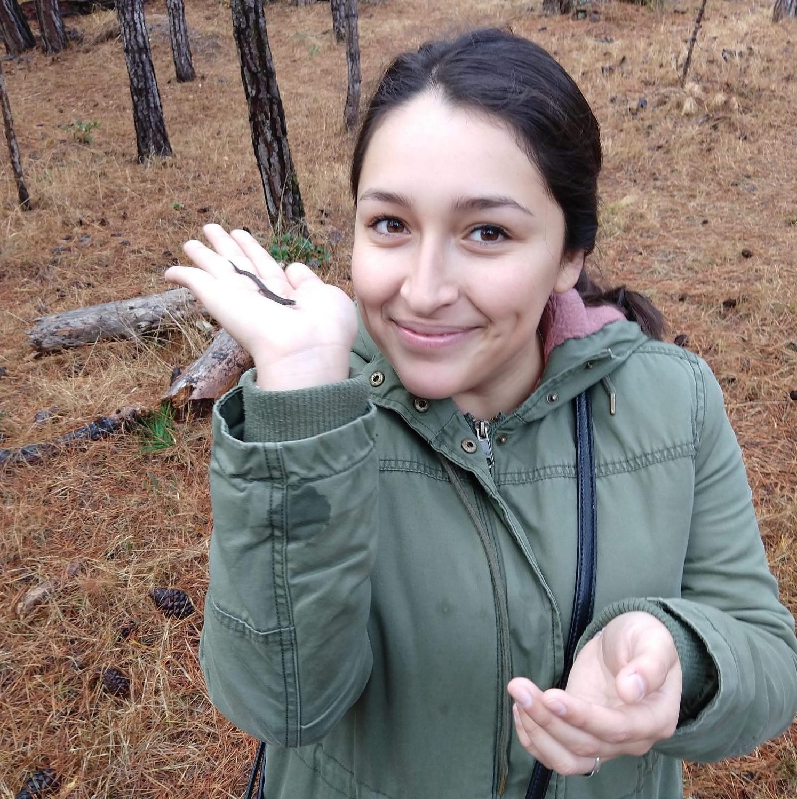

```{r setup, include=FALSE}
knitr::opts_chunk$set(echo = FALSE)
```

I am originally from Lima, Peru, but largely grew up in Los Angeles. During my undergraduate education at California State University, Monterey Bay (CSUMB), I was part of the National Science Foundation's Research Experience for Undergraduates program. I had the opportunity to work with Dr. Steve Litvin & Dr. Jim Barry at the Monterey Bay Aquarium Research Institute (MBARI) documenting the effects of future climate change on abalone. I presented the results of my research at conferences SACNAS and the Wildlife Society's Annual Symposium in 2018.

I am also passionate about environmental outreach. At CSUMB, I volunteered with the non-profit organization, Return of the Natives, where I aided in an environmental education program for 4th-5th graders and assisted with community planting events to restore native dune flora to the Monterey coast. Now, I am working as a research assistant for Dr. Anastasia Quintana, helping with her postdoctoral research on MPA compliance in small-scale fisheries.


## Interests

I love being outdoors and exploring local trails. I have a particular affinity for surveying herptile communities (lizards, snakes, amphibians). My favorite field days were the ones where I had the opportunity to interact with native California wildlife and learn about their ecology and relevant conservation efforts. You can always find me in the field looking for cool snakes and lizards! I previously volunteered at the UCSC Fort Ord National Reserve monitoring coastal horned lizard populations to inform the dissertation of Ph.D candidate, Danielle Davis.



Aside from that, I am highly passionate about environmental justice issues and I am an avid supporter of black & indigenous rights. I hope to apply my data analysis skills to serve underprivileged groups.

I currently reside in Goleta, CA (Chumash land) with my pet bunny and partner.


